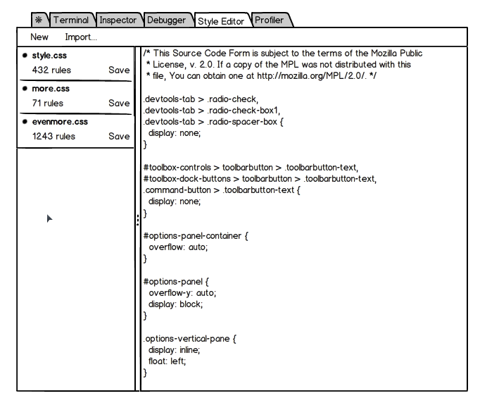
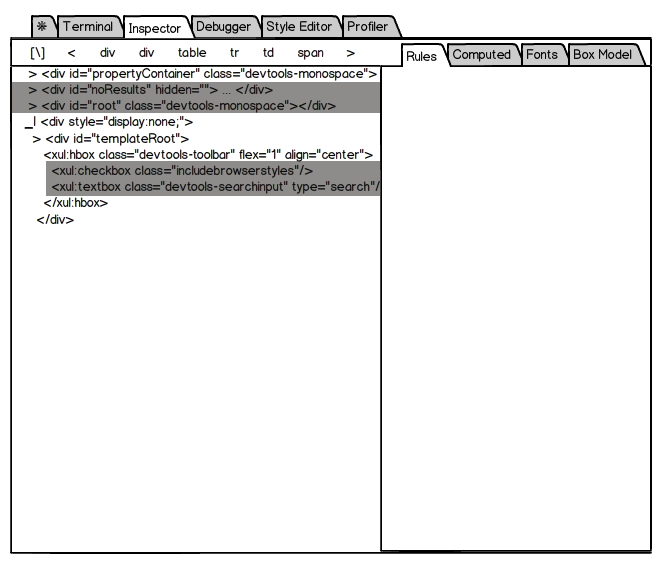
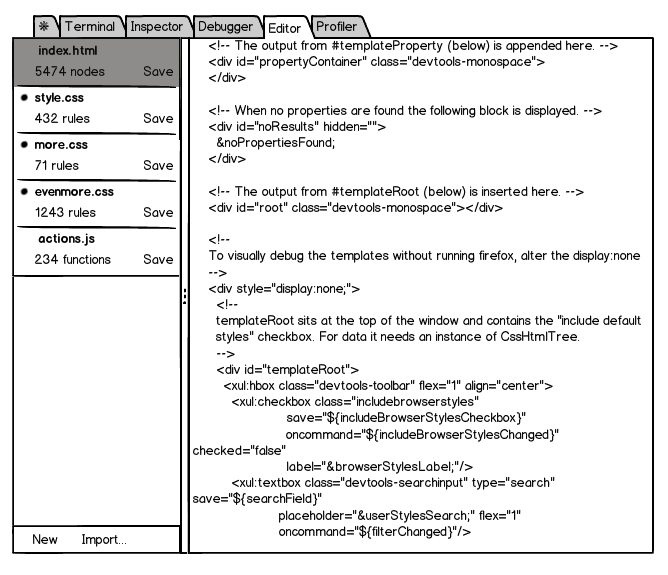
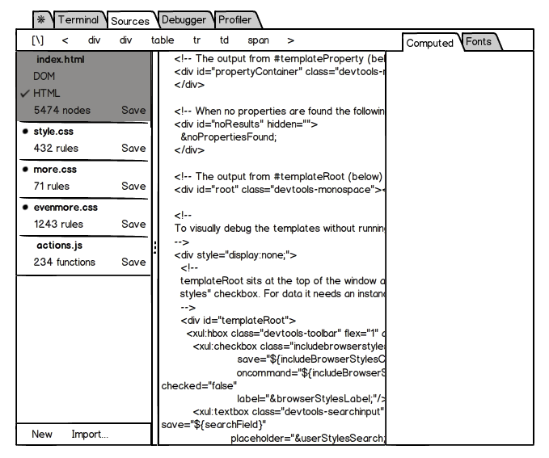
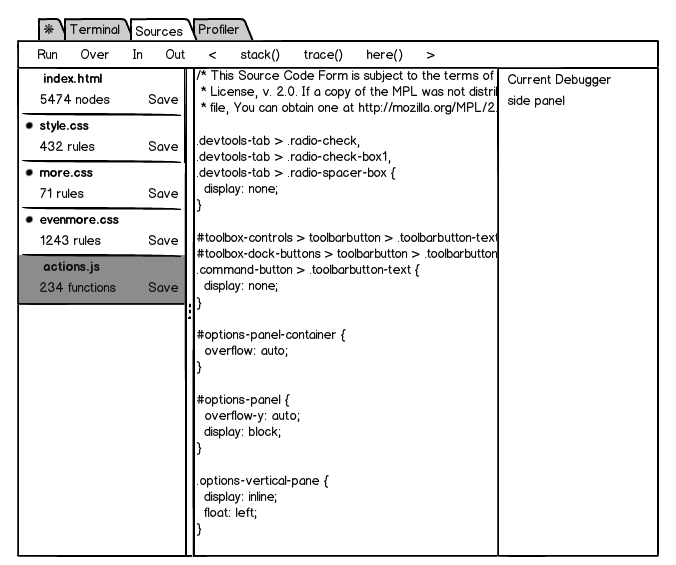

# Authoring in Firefox Developer Tools

## TL;DR

There's a lot here. So lets start with a TL;DR.

* Live editing rocks
* Creating a 'sources' panel that beings together HTML/JS/CSS is a good goal
* But it's a long term goal. In the short term we want to add live HTML editing
  to the Style Editor Panel

## Where we are now

We have:

* CSS: Live editing in the CSS editor
* HTML: Basic Markup view editing
* JavaScript: Debugging and script prototyping in Scratchpad

Stuff we'd like to polish:

* CSS: Syncing changes from rule view to style editor, integration with
  highlighter, improved save experience
* HTML: Drag and drop editing
* JavaScript: Rationalizing the number of input areas

Beyond this - we'd like to be able to live-edit HTML, CSS and JavaScript in
Firefox. This document is about how we get there.

Before we talk UI, we need to break out some tech first.

One of the problems of web development (maybe even *the* problem) is that
browsers are a black box for most web developers. There are WAT moments for
[HTML](http://jakearchibald.github.io/request-quest/),
[CSS](https://twitter.com/slicknet/status/9789299977) and
(obviously) [JS](https://www.destroyallsoftware.com/talks/wat).

It would be good to be able to start with the users mental model for how
browsers work, but average-Joe developer's mental model of the web is generally
non-existant or wrong. Our tools need to reflect the principles of how the web
works to help users begin to understand how browsers work.

## Scope

While we are thinking about authoring on the web, we should list some problems
that we're not interested in solving right now:

* Editing server-side languages like PHP, Java, Python
* Talking to databases
* Uploading resources to a web-server

We may, by being good at editing HTML/JS/CSS also end up being good at NodeJS

## Complexities of Authoring

There are a number of ways in which live-editing isn't simple. For each of
HTML/CSS/JS it comes down to 2 issues:

* The 'internal wiring' problem of keeping in sync with post-authoring changes.
i.e getting notified, and making sure the right parts know of changes
* The wiring problem is compounded by irreversible/lossy transformations from
the authored text (making it hard to compare current and authored state)

### CSS

These problems manifest themselves in CSS as follows:

* We need to keep the various inspectors and editors in sync with each other
* CSS parsing typically strips out syntactically incorrect CSS, which we want
to present to the user

### JavaScript

Our JS engine doesn't support dynamically updating scripts. But there are still
2 issues:

* Simple changes to a script (e.g. changing ``var foo`` to ``var bar``, or just
  adding a ``{``) can fundamentally alter the semantics of large chunks of code
* Editing a source may change it in ways which are incompatible with the
  dynamic state of the JS runtime

We believe we have a method of using the Debugger API to give the impression
that functions not on the stack have been altered dynamically. Structural
changes would not be supported.

### HTML

The live browser DOM is quite different from what the user typed for a number
of reasons:

* A DOM is an in-memory tree (obviously) but this is lossy compared to the HTML
  * Whitespace is compacted and entities resolved
  * Attribute delimiters (' and ") are forgotten
  * Attribute ordering is lost
  * etc
* Parsing alters the HTML
  * 'Missing' tags are added (e.g. ``
`` and ``<tbody>``)
  * Misplaced elements are moved (e.g. ``<table>
hi
<tr><td>1</table>``)
  * etc
* Dynamic updates happen from JavaScript
* The user may have typed in PHP, ASP, etc which was converted by the server.

It is possible to extract HTML from a DOM, allow it to be edited, and use
innerHTML to insert it back into the DOM however:

* This will remove event handlers, which could prevent the page from working
* It's hard to replicate these changes to the original authored source

Our plan for live-editing HTML is to use a tree based diff/match/patch
algorithm to port changes between DOM trees.

1. We store the HTML read from the network and create a separate DOM from it.
   Ideally the parser used for this would retain whitespace etc and be able to
   reconstruct the original HTML from this separate DOM.
2. We can now use a tree diff to find the nodes that have been altered by
   JavaScript since page load by comparing the live DOM with the network DOM.
   We may chose to display these nodes in the Markup View with a different
   color background
3. We generate a pretty printed HTML serialization from the live DOM. This will
   be very different from the HTML read from the network for the reasons
   specified above
4. We can then create another separate DOM from this HTML serialization. A tree
   diff of these 2 trees should find no changes
5. We allow the user to edit the pretty printed HTML serialization, continuing
   to create tree diffs
6. The patches created in step 5 can then be applied to the live DOM, and given
   a 3 way diff, we may be able to keep both trees in sync. If there are any
   difficulties applying changes then the live DOM 'wins'
7. We can then attempt to apply the same set of changes to the DOM created from
   the network HTML to allow 'save to disk' to work

I believe Adobe is working on this with [Brackets](http://download.brackets.io/)

## User Interface

So the real point of all this is - how do we evolve our user interface to take
account of this technology?

Here's our best live-edit panel so far:

No shocks there.

I suggested that we markup the markup panel to show DOM elements that have
changed since loading as a step on the road to live-HTML-editing.

So here's a mockup of the markup on the markup panel:

Probably no shocks there either.

So how do we actually do live editing of HTML?

The obvious and simple thing is to upgrade the Style Editor panel with HTML
sources.

We'll need some sort of 'Project Map' to make save-to-disk easy, and this
should let us edit any file on the filesystem so long as it's plain text.

I also added a JavaScript source here, not because we're doing live-editing of
JavaScript, but because the ability to edit your sites JavaScript from within
this Editor pane would be useful. In fact it would be annoying to not be able
to do that. We just need to make sure people don't expect live-editing and
we're OK.

We've talked lots about integrating the highlighter and the Style Editor. In
fact being able to see things like the Font View and the Box Model while you
are editing CSS could be very useful.

So we could merge the Inspector and the Editor panels

There are 2 modes for editing HTML: Plain text and Markup View. The user can
pick which from the navigation panel on the left hand side.

We have a 3 column view here:

1. Navigation
2. Editors
3. Stuff related to the current source

Also there is a navigation bar at the top which shows you where you are right
now.

So here's the thing - that's exactly the layout of the Debugger panel.

So we might be able to have a single 'Sources' panel that lets us keep all of
our sources in one place.

Now I've skirted around a few things here. The biggest of which is the
navigation panel on the left hand side. How are the files laid out there? The
trouble is there are 3 options:

1. In a tree as on the filesystem
2. In a tree as presented by the web server (probably similar to #1, but
doesn't need to be, and the will probably be a differing initial path)
3. In a tree as observed by the browser (where iframes and stylesheets can both
act as 'parents' for other resources)

I suspect that all 3 layouts will be important, and that we'll need to find a
way to switch between them.
