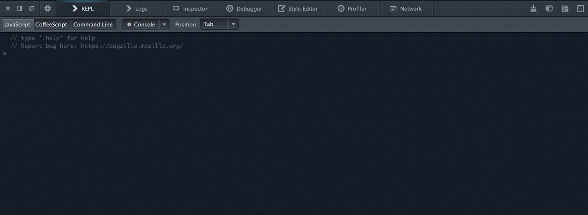

# Mockup of a proposed REPL

Here's the basics of what I'm thinking. (Photoshopped)

## Questions

### CoffeeScript from day 1?

Maybe not, but we might want it someday

### How do you switch between JS/Coffee/Commands?

You can click the buttons in the toolbar or press magic keys.

I expect the buttons might read like this:

      [ JavaScript { | CoffeeScript ; | Command line : ]

To give users the clue that you can also switch by pressing one of { ; or :
And yes, I made the shortcut for CoffeeScript ';'. I may relent.

When you execute a JS command, we stay in JS mode, same for CoffeeScript and
Commands.

### Does the REPL include console output?

There are 3 options:

1. No, never
2. Yes, always
3. Yes if the console.xxx command was typed in the REPL, not otherwise

The 'Console' dropdown allows toggling between these 3.
The default is 3. We're trying to draw a line between being clean and not
confusing the heck out of people who type `console.log(foo);` and then can't
work out where the output went.

The Log panel includes console output from the REPL and the page, and allows
for filtering by level.

### What REPL positions are available?

2 or 3 or 4.
In order of importance:

* 'Tab' is what you see.
* 'Below' is attached the the bottom of the toolbox. The REPL is no longer
  available as a Tab when attached to the bottom
* 'Detached' (probably not day 1)
* 'Side' (probably not day 1) For widescreen monitor use

### What happens to the input area in the console?

It goes away. The console becomes a read-only 'Log' panel.
