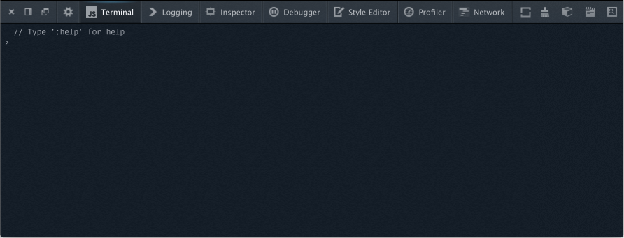

# Mockup of a proposed Terminal

A lot of this is about how the Terminal functions, but it also touches the
larger toolbox, so we'll need to make sure it fits with Shorlanders plans
([Latest?][1])

Here's the basics of what I'm thinking. (Photoshopped)

If you remember previous iterations:
* The toolbar is gone
* The panel names have changed to 'Terminal' and 'Logging'
* There is a new toolbar button

[1]: http://people.mozilla.com/~shorlander/files/devtools/creation/devtools-creation-i01.html

## Questions

### CoffeeScript from day 1?

Probably not, but we might want it someday. Also there are many other candidates
for compile to JS languages that we could add here. CoffeeScript is just an
initial example.

### How do you switch between JS/Coffee/Commands?

Most people won't need to do this regularly.

There will be a 'lang' command that allows you to change between languages.
Initially the only options will be 'javascript' and 'command', but we can add
'coffee', etc.

Also in javascript mode, you can access commands by prefixing with a ':'.

### Does the terminal include console output?

The terminal will initially include:

* console output both from the page and from the terminal
* uncaught exceptions

These messages will also be available in the Logging panel, however by default
they will be turned off there.

The terminal will not include:

* XHR requests
* Errors/warnings from CSS/XUL/chrome/etc

If experience shows that we need to, we may add a command to filter the
displayed output:

    ﹥ terminal show --console [yes|no|terminal]
    ﹥ terminal show --exceptions [yes|no|terminal]

Or something. The exact syntax isn't important unless we're doing this in day 1.

### What about the prompt

We've a number of ideas for prompts. I am currently proposing that we use a
simple > for all languages, and indicate the current language in the icon for
the terminal (see the screenshot above)

(Note, I've used ﹥ in this document because > is special to Markdown)

We have discussed having the language as part of the prompt either as a symbol
or a name like:

    JS>

However I think this is likely to be extremely repetitive. So long as people
can see the language in the icon and have a reminder in the MOTD they'll be OK.

### What is the MOTD?

Something like:

      // Welcome to the JavaScript terminal. Type ':help' for help
    ﹥

Clearly the message would change if the current language was Coffeescript etc.

### What Terminal positions are available?

Initially 2 positions are available

* 'Tab' is what you see in the graphic above.
* 'Below' is attached the the bottom of the toolbox. The Terminal tab is no
  longer available when attached to the bottom

Later revisions may enable detachable or side docked positions.

The position is selected using an toggle button in the toolbar (next to the
buttons for paint flashing, tilt, etc)

### What happens to the input area in the console?

It goes away. The console becomes a read-only 'Log' panel.

### How does completion work?

Our goal with completion is simply to speed the user up. This means:

* Fewer keypresses
* Minimum distraction
* Maximum predictability

Further, it means:

* The user should be able to type 'long-hand' and completion never gets in the
  way.

There are some caveats to that:

* ``<TAB>`` is special. Use ``\t`` (or similar) if you mean the TAB character

This implies:

* ``<LEFT>`` and ``<RIGHT>`` move the cursor rather than accepting completion
* Keys that the user expects to do things should not be stolen by completion
  i.e, if the user types ``window.screen<RETURN>``, then just before
  ``<RETURN>`` is pressed, the user sees:

        ﹥ window.screen
               | screen   |
               | screenX  |
               | screenY  |
               '----------'

  Pressing return executes ``window.screen`` rather than making a selection
  from the menu.

### Prefix completion

Prefix completion is broken. It encourages you to start typing with what is
probably the *most* ambiguous part of what you want to type. Commonly the
right-most part of a parameter is both the least ambiguous and the thing you
are thinking of when you're typing.

Whatever your current directory, if your command-line was smart, it could
probably work out what you meant by:

    ﹥ edit gDevTools.jsm

Conceptually the same is true of JavaScript completion too:

    ﹥ href

Probably means ``window.location.href``.

We're away off this kind of command line heaven, but not *that* far off.

So a good model for completion that works however smart your completion system
is is:

* Let the user type, and present them with a best guess (select with ``<TAB>``)
  and some alternatives (pick with ``<UP>``/``<DOWN>`` followed by ``<TAB>``)

### But prefix completion is in my muscle memory

I think we should do everything we can possibly can to help people who have
mental wiring for prefix-completion, in order:

* Ensure that our ``<TAB>`` completions are what people would expect if they
  were clearly thinking of prefix completion. So ...

        ﹥ edit /Applica<TAB>

  should complete to ``edit /Applications/``

* Allow a key sequence like ``<SHIFT>+<TAB>`` to do true prefix completion
* If people complain in significant numbers, then offer an option to change
  back

### How are completions presented

When there is a completion that is a *suffix* of what has been typed so far
then it should be presented in a lighter color inline.

    ﹥ window.setTim|eout

(The cursor is the '``|``', we need a blink tag. Also, imagine that ``eout``
is in a lighter color)

When the completion is not a suffix it should be presented inline in full
following a ``⇥`` (i.e. what's printed on the TAB key)

    ﹥ wndow| ⇥ window

When the cursor isn't at the end of the input the same applies

    ﹥ wn|dow ⇥ window

The completion proposal should always be appropriate to where the cursor is
however:

    ﹥ wn|dow.setTime ⇥ window

    ﹥ wndow.setTi|me ⇥ setTimeout

Some of this could be hard to code (particularly the last one) so it's OK to
keep things simple by only attempting completion proposals when the cursor is
at the end of the input.

### What if there is more than one completion option?

Options are presented inline, below the input

    ﹥ set|Timeout
     | setTimeout   |
     | setInterval  |
     | setResizable |
     '--------------'

I know I'm using ASCII-art above but that's just lazyness. We don't have a
fixation with text-only. This is The Web not some 80s teletype throwback disco.

Having a horizontal menu is nice in that it takes up unused real-estate, but
it's confusing to navigate when ``<LEFT>`` and ``<RIGHT>`` are reserved for the
cursor, so our menus are vertical with a maximum of 5 options.

### What about history?

With an empty command line, ``<UP>`` and ``<DOWN>`` navigate through history.

If the user has started to type and then presses ``<CTRL>+R`` the history is
shown filtered by things that match what has been typed so far

If the user presses ``<CTRL>+R`` to start with then the full history is
initially shown, and is then filtered as the user types.

    ﹥ <UP>
     | window.setTimeout    |
     | window               |
     | window.location.href |
     | setTimeout           |
     '----------------------'

    ﹥ win<CTRL>+R
     | window.setTimeout    |
     | window               |
     | window.location.href |
     '----------------------'

### What about multi-line input?

Multi-line input attempts to make the terminal act more like an editor. This
has a number of complications:

* How do you differentiate between new-line and execute (both of which would
  traditionally use ``<RETURN>``?
* Do we support code indenting using the ``<TAB>`` key?
* Do we allow the ``<UP>`` and ``<DOWN>`` keys to select alternative options
  when the user may expect cursor movement.

We will use ``<SHIFT>+<RETURN>`` to enter multi-line edit mode, and to execute
the command (a.k.a exit from multi-line edit mode)

In keeping with common use in text editors we will not have automatic
completion but will rely on the user pressing ``<CTRL>+<SPACE>`` in order to
request hints.
