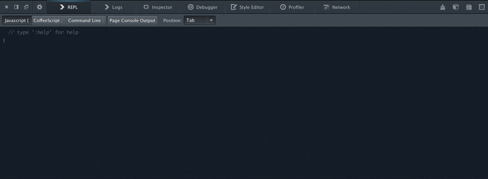

# Mockup of a proposed REPL

Here's the basics of what I'm thinking. (Photoshopped)

## Questions

### CoffeeScript from day 1?

Probably not, but we might want it someday. Also there are many other candidates
for compile to JS languages that we could add here. CoffeeScript is just an
initial example.

### How do you switch between JS/Coffee/Commands?

You can click the buttons in the toolbar or press magic keys.

The buttons might read like this:

      [ JavaScript { | CoffeeScript ; | Command line : ]

To give users the clue that you can also switch by pressing one of { ; or :
And yes, I made the shortcut for CoffeeScript ';'. I may relent.

If you're typing CoffeeScript (or anything other than JS) you expect:

* To be able to get back to JS easily
* To be able to continue typing CoffeeScript (etc) when you've pressed return
  (CoffeeScript users would get *really* mad if we made them press ``;`` at the
  start of every line)

Getting back to JS with a ``{`` is easy and memorable, but not discoverable.
The buttons make it much more discoverable.

Also: Under consideration - change the prompt from '>' to reflect the current
mode [{|;|:]

There is an understandable move to get rid of the toolbar. If we are to do that
then we need to solve the problem of discovering how to switch between
languages.

### Does the REPL include console output?

There are 3 options:

1. No, never
2. Yes, always
3. Yes if the console.xxx command was typed in the REPL, not otherwise

We're agreed that 1 isn't what most people want.

Option 2 is simple, and the only sensible default if we're getting rid of the
toolbar.

Option 3 is hard to explain, certainly in the number of words that you would
like in a user-interface. However it avoids chatty pages messing up a clean
REPL. How often is this a problem in reality though?

The Log panel includes console output from the REPL and the page, and allows
for filtering by level.

### What REPL positions are available?

2 or 3 or 4.
In order of importance:

* 'Tab' is what you see.
* 'Below' is attached the the bottom of the toolbox. The REPL is no longer
  available as a Tab when attached to the bottom
* 'Detached' (probably not day 1)
* 'Side' (probably not day 1) For widescreen monitor use

### What happens to the input area in the console?

It goes away. The console becomes a read-only 'Log' panel.

### What would it look like with Position:Bottom

This is how we'd hack JS while debugging ...

I forgot to update the text in the "Position" drop-down. Shoot me.

### To consider

Could we get rid of the toolbar?
The motivation for doing this: It keeps things clean and options are often just
a crutch for developers failing to make a decision.

Getting rid of the 'language' switch:
The switch wouldn't be used that often, we could add some usage hints to the
startup page.
OTOH I think we need to be ultra-clear about the language that is being spoken
and knowing how to switch is important too.

Getting rid the 'Page Console Output' switch:
Actually how much mess would we create by just adding *all* console output to
the REPL? Also the button to toggle page console output is hard to get right -
that's a clumsy name we've got there.

Getting rid of the Position switch:
Could we make do with 2 extra toolbar buttons, one which created a new floating
REPL (not day 1) and the other which toggled a bottom-attached REPL. The tab
based REPL would be toggleable via the options panel still.

### How does completion work?

Our goal with completion is simply to speed the user up. This means:

* Fewer keypresses
* Minimum distraction
* Maximum predictability

Further, it means:

* The user should be able to type 'long-hand' and completion never gets in the
  way.

There are some caveats to that:

* ``<TAB>`` is special. Use ``\t`` (or similar) if you mean the TAB character

This implies:

* ``<LEFT>`` and ``<RIGHT>`` move the cursor rather than accepting completion
* Keys that the user expects to do things should not be stolen by completion
  i.e:

      ``> window.screen<RETURN>``

  Should do the obvious thing (inspect ``window.screen``) and not nothing.

### What about prefix completion?

Prefix completion is broken. It encourages you to start typing with what is
probably the *most* ambiguous part of what you want to type. Commonly the
right-most part of a parameter is both the least ambiguous and the thing you
are thinking of when you're typing.

Whatever your current directory, if your command-line was smart, it could
probably work out what you meant by:

    $ edit gDevTools.jsm

And this is probably true even given several checkouts of central if you have
access to someone's command history.

Conceptually the same is true of JavaScript completion too:

    > href

Probably means ``window.location.href``.

We're away off this kind of command line heaven, but not *that* far off.

So a good model for completion that works however smart your completion system
is is:

* Let the user type, and present them with a best guess (select with ``<TAB>``)
  and some alternatives (pick with ``<UP>``/``<DOWN>`` followed by ``<TAB>``)

### But prefix completion is in my muscle memory

I think we should do everything we can possibly can to help people who have
mental wiring for prefix-completion, in order:

* Ensure that our ``<TAB>`` completions are what people would expect if they
  were clearly thinking of prefix completion. So ...

      $ edit /Applica<TAB>

  should complete to ``edit /Applications/``

* Allow a key sequence like ``<SHIFT>+<TAB>`` to do true prefix completion
* If people complain in significant numbers, then offer an option to change
  back

### How are completions presented

When there is a completion that is a suffix of what has been typed so far then
it should be presented in a lighter color inline.

``> window.setTim|````eout``

(The cursor is the '``|``', and it looks a bit bizarre because Markdown.
Imagine it looks better)

When the completion is not a suffix it should be presented inline in full
following a ``⇥`` (i.e. what's printed on the TAB key)

``> wndow|`` ``⇥ window``

Options are presented inline, below the input

    > set|Timeout
     | setTimeout   |
     | setInterval  |
     | setResizable |
     '--------------'

I know I'm using ASCII-art above but that's just lazyness. We don't have a
fixation with text-only. This is The Web not some 80s teletype throwback disco.

Having a horizontal menu is nice in that it takes up unused real-estate, but
it's confusing to navigate when ``<LEFT>`` and ``<RIGHT>`` are reserved for the
cursor, so our menus are vertical with a maximum of 5 options.

### What about history?

With an empty command line, ``<UP>`` and ``<DOWN>`` navigate through history.

If the user has started to type and then presses ``<CTRL>+R`` the history is
shown filtered by things that match what has been typed so far

If the user presses ``<CTRL>+R`` to start with then the full history is
initially shown, and is then filtered as the user types.

    > <UP>
     | window.setTimeout    |
     | window               |
     | window.location.href |
     | setTimeout           |
     '----------------------'

    > win<CTRL>+R
     | window.setTimeout    |
     | window               |
     | window.location.href |
     '----------------------'

### What about multi-line input?

Working ...

Multi-line input is tricky because:

* What does ``<RETURN>`` do: new-line or execute? And how does the user discover
  how to do the other thing?
* ``<UP>`` and ``<DOWN>`` can no longer be used for selecting options without
  clashing.

